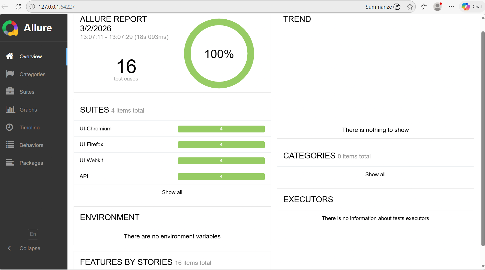

# Enterprise Playwright Framework

## Tech Stack
- Playwright
- TypeScript
- CI/CD (GitHub Actions)
- Docker
- API + UI Testing

## Features
- Page Object Model
- Environment-based config
- Parallel execution
- HTML Reporting
- Dockerized test execution
- CI pipeline integration

## Run Tests

npx playwright test

## Run with Docker

docker build -t playwright-framework .
docker run playwright-framework

## Test Report Screenshot


# Allure Report
 npm install -D allure-playwright
 npx playwright test --reporter=line,allure-playwright
 npx allure generate ./allure-results --clean
 npx allure-commandline open




# Enterprise Playwright Framework


                

This repository contains an **enterprise-grade Playwright framework** with CI integration for automated testing of UI and API projects.

---

## Scalable Test Orchestration (CI/CD)

This framework is architected for **Horizontal Scalability**. Instead of a single-node execution, it utilizes **Test Sharding** to distribute workloads across multiple ephemeral servers simultaneously.

### Distributed CI Pipeline Overview

```mermaid
graph TD
    A[Code Push] --> B{GitHub/Jenkins Orchestrator}
    B -- Matrix Shard 1 --> C[Node 1: UI Tests]
    B -- Matrix Shard 2 --> D[Node 2: API Tests Part 1]
    B -- Matrix Shard 3 --> E[Node 3: API Tests Part 2]
    C & D & E --> F[Upload Blob Artifacts]
    F --> G[Merge Job: Unified HTML Report]
    G --> H[Final Status: Success/Failure]