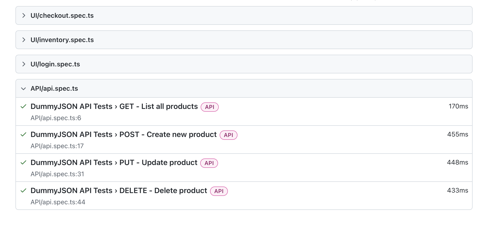

# Enterprise Playwright Framework

## Tech Stack
- Playwright
- TypeScript
- CI/CD (GitHub Actions)
- Docker
- API + UI Testing

## Features
- Page Object Model
- Environment-based config
- Parallel execution
- HTML Reporting
- Dockerized test execution
- CI pipeline integration

## Run Tests

npx playwright test

## Run with Docker

docker build -t playwright-framework .
docker run playwright-framework

